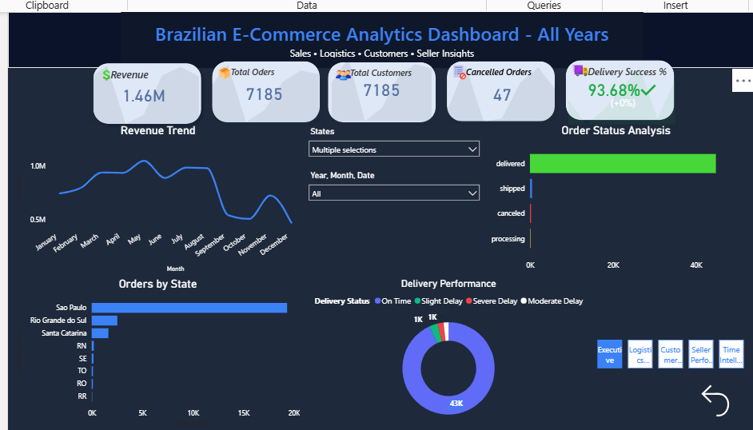
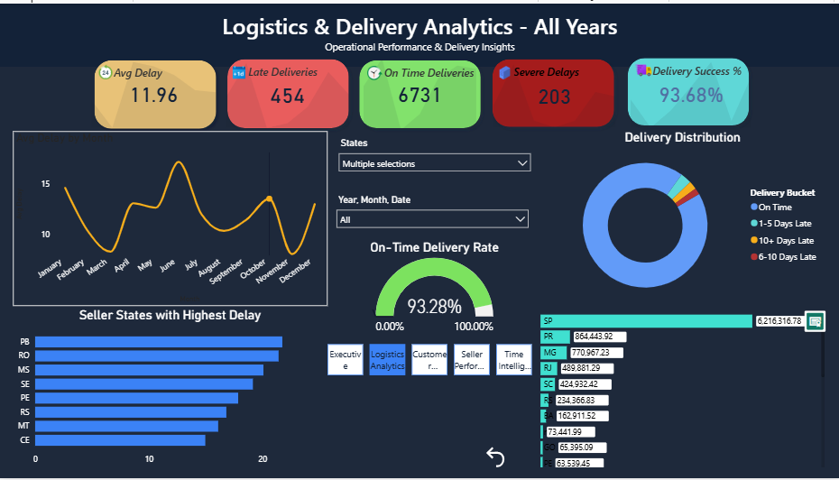
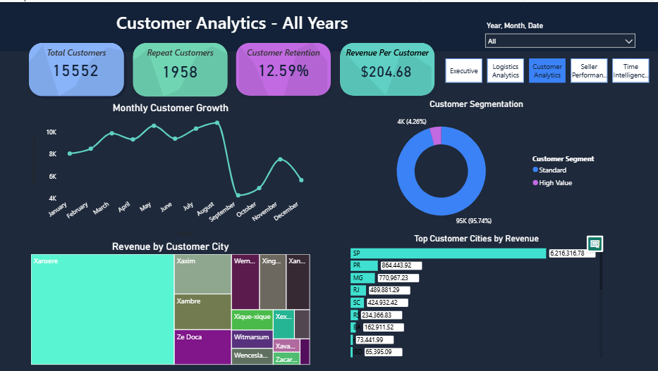
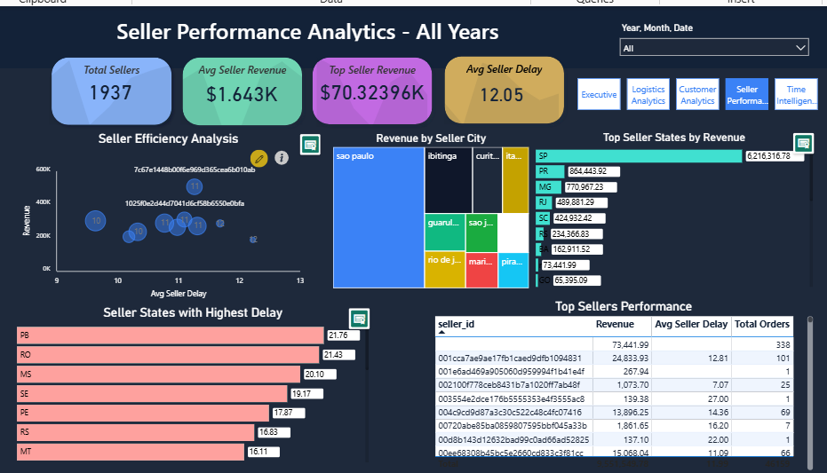
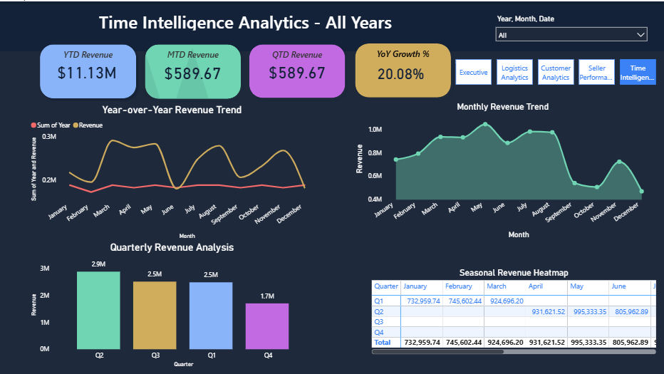

# Brazilian E-Commerce Analytics | Azure End-to-End Data Engineering Project
Enterprise-grade end-to-end Azure Retail Analytics solution using ADLS Gen2, Databricks, Delta Lake, Synapse Serverless SQL, and Power BI. Implements Medallion Architecture (Bronze/Silver/Gold), star schema modeling, advanced DAX analytics, and interactive business dashboards using the Brazilian E-Commerce dataset.

## Project Overview

This project demonstrates an enterprise-grade end-to-end Azure Data Engineering and Business Intelligence solution using the Brazilian E-Commerce dataset.

The project implements a modern Medallion Architecture (Bronze → Silver → Gold) using Azure Data Lake Storage Gen2, Azure Databricks, Azure Synapse Analytics, and Power BI.

The solution processes raw e-commerce transactional data, performs data transformation and business modeling, and delivers interactive analytical dashboards for executive, logistics, customer, seller, and time intelligence reporting.

---

# Architecture

## End-to-End Architecture Flow

CSV Dataset
↓
Azure Data Lake Storage Gen2 (Bronze Layer)
↓
Azure Databricks (Silver Layer)
↓
Azure Databricks Gold Layer (Delta Tables)
↓
Azure Synapse Serverless SQL Views
↓
Power BI Interactive Dashboards

---

# Technologies Used

| Technology | Purpose |
|---|---|
| Azure Data Lake Storage Gen2 | Data Lake Storage |
| Azure Databricks | Data Processing & Transformation |
| Delta Lake | Lakehouse Storage Format |
| Azure Synapse Analytics | Serverless SQL Analytics |
| Power BI | Dashboarding & Visualization |
| PySpark | ETL Transformations |
| SQL | Data Querying |
| DAX | KPI Calculations |

---

# Medallion Architecture

## Bronze Layer
- Raw CSV ingestion
- Stores source data without transformations
- Maintains raw historical records

## Silver Layer
- Data cleaning
- Null handling
- Data type casting
- Delivery delay calculations
- Data standardization

## Gold Layer
- Star schema modeling
- Fact and dimension tables
- Business-ready analytics layer
- Optimized for Power BI reporting

---

# Data Model

## Fact Table

### fact_orders
Contains:
- Order details
- Revenue
- Delivery delays
- Customer and seller references

## Dimension Tables

### dim_customer
Contains:
- Customer city
- Customer state

### dim_seller
Contains:
- Seller city
- Seller state

### Dim_Date
Date intelligence table for:
- YTD
- MTD
- QTD
- YoY calculations

---

# Azure Components

## Azure Data Lake Storage Gen2
Used for:
- Bronze storage
- Silver storage
- Gold storage
- Delta table management

## Azure Databricks
Used for:
- ETL processing
- Data transformation
- Delta Lake operations
- Business layer generation

## Azure Synapse Analytics
Used for:
- Serverless SQL querying
- Delta table access
- SQL view creation
- Power BI integration

## Power BI
Used for:
- Interactive dashboards
- KPI reporting
- Time intelligence
- Business analytics

---

# Power BI Dashboards

## 1. Executive Dashboard
Features:
- Revenue KPI
- Total Orders
- Total Customers
- Delivery Success Rate
- Revenue Trend
- State-wise Orders

---

## 2. Logistics & Delivery Analytics
Features:
- Avg Delay
- Late Deliveries
- On-Time Deliveries
- Delivery Distribution
- Delay Analysis by State

---

## 3. Customer Analytics
Features:
- Customer Retention
- Revenue Per Customer
- Customer Segmentation
- Revenue by Customer City

---

## 4. Seller Performance Analytics
Features:
- Seller Revenue
- Seller Efficiency
- Seller Delay Analysis
- Top Seller Performance

---

## 5. Time Intelligence Analytics
Features:
- YTD Revenue
- MTD Revenue
- QTD Revenue
- YoY Growth
- Monthly Revenue Trend
- Quarterly Analysis

---

# Key Features

- Enterprise Medallion Architecture
- Delta Lake Integration
- Synapse Serverless SQL
- Advanced Power BI Dashboards
- Star Schema Modeling
- DAX Time Intelligence
- End-to-End Azure Pipeline

---

# Power BI DAX Measures

Main KPIs:
- Revenue
- Total Orders
- Total Customers
- Delivery Success %
- Avg Delay
- Revenue Growth %
- YTD Revenue
- MTD Revenue
- QTD Revenue
- YoY Growth %

---

# Dashboard Preview

## Executive Dashboard

## Logistics Dashboard

## Customer Dashboard

## Seller Dashboard

## Time Intelligence Dashboard

---

# Project Workflow

1. Ingest raw CSV files into Bronze Layer
2. Clean and transform data in Silver Layer
3. Create analytics-ready Gold Layer tables
4. Build Synapse SQL Views
5. Connect Power BI to Synapse
6. Develop interactive dashboards

---

# Skills Demonstrated

- Azure Data Engineering
- Azure Databricks
- Delta Lake
- Synapse Analytics
- Power BI Development
- Data Modeling
- DAX
- ETL Pipelines
- Data Warehousing
- Business Intelligence

---

# Future Improvements

- Azure Data Factory orchestration
- Incremental loading
- CI/CD pipeline integration
- Real-time streaming analytics
- Machine learning integration

---

# Author

Sripada Arun
arunsripada23@gmail.com
6281186989

LinkedIn:
[(Add your LinkedIn URL)](https://www.linkedin.com/in/sripada-arun-586183408/)
